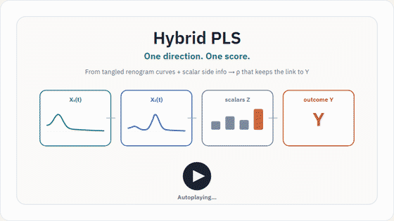

# FSHybridPLS: Functional and Scalar Hybrid Partial Least Squares

**FSHybridPLS** performs Partial Least Squares (PLS) regression on **hybrid** predictors: a single object that combines **functional data** (curves / time series as `fda::fd` objects) and **scalar covariates** (numeric matrices).

The package treats a hybrid predictor as an element of a product Hilbert space \(\mathcal{H} = \mathcal{F} \times \mathbb{R}^p\) and implements the arithmetic and algorithms needed to run **roughness-penalized PLS** directly in that space.

It provides an R implementation of Mun and Jang (2026), *Hybrid Partial Least Squares Regression with Multiple Functional and Scalar Predictors* (co-authored with Jeong Hoon Jang, University of Texas Medical Branch):  
<https://doi.org/10.48550/arXiv.2601.16364>

## Idea in one minute

Hybrid PLS builds **one supervised score** \(\rho\) from tangled renogram curves and scalar side information:

<p align="center">
  
</p>

The demo GIF uses **`loading="lazy"`** so it begins when you scroll it into view (then loops). For play / pause / scrub, open the live site — it also autoplays when the stage becomes visible.

- Live site: <https://jong-min-moon.github.io/FShybridPLS/>
- CDN mirror: <https://cdn.jsdelivr.net/gh/Jong-Min-Moon/FShybridPLS@main/animation/index.html>

## Installation

```r
# Once on CRAN:
install.packages("FSHybridPLS")

# Development version:
# remotes::install_github("Jong-Min-Moon/FShybridPLS")
```

## Quick start

```r
library(FSHybridPLS)
set.seed(1)

sim <- simulate_hybrid_data(n = 60, n_functional = 1, n_scalar = 3, n_basis = 7)
prep <- split_and_normalize_all(sim$W, sim$y, train_ratio = 0.7)

fit <- fit_hybridPLS(
  prep$predictor_train,
  prep$response_train,
  n_iter = 3,
  lambda = 1e-3,
  validation_data = list(
    W_test = prep$predictor_test,
    y_test = prep$response_test
  )
)

fit
preds <- predict(fit, prep$predictor_test, n_components = fit$n_iter)
sqrt(mean((prep$response_test - preds)^2))

# Optional: choose the number of components by CV on the training set
cv <- cv_fit_hybridPLS(
  prep$predictor_train,
  prep$response_train,
  n_iter = 5,
  lambda = 1e-3,
  n_fold = 5,
  seed = 1
)
cv$best_n_iter
```

See the package vignette for a longer walkthrough:

```r
vignette("FSHybridPLS", package = "FSHybridPLS")
```

## Concepts

### Hybrid predictor class (`predictor_hybrid`)

A hybrid predictor \(\mathbf{W} = (X, \mathbf{Z})\) packages:

- **Functional part:** \(K\) random functions \(X^{(k)}\) in \(L^2([0,1])\), stored as `fd` objects.
- **Scalar part:** a \(p\)-dimensional covariate matrix \(\mathbf{Z}\).
- **Precomputed structure:** Gram matrices and roughness-penalty matrices for each functional basis, used for fast algebraic inner products.

Constructor:

```r
W <- predictor_hybrid(Z, functional_list, eval_point, penalty_order = 2)
```

For synthetic examples, prefer `simulate_hybrid_data()`, which returns both `W` and `y`.

### Penalized PLS (main algorithm)

`fit_hybridPLS()` iteratively extracts components that maximize covariance between the hybrid predictors and a scalar response, with roughness penalties on functional directions.

At each iteration it:

1. Computes a penalized weight direction \(\xi\).
2. Forms PLS scores by projecting predictors onto \(\xi\).
3. Estimates loadings for response and predictors.
4. Deflates (residualizes) predictors and response.
5. Updates the cumulative hybrid regression coefficient \(\beta\).

The fitted object has class `hybridPLS`, with S3 methods `print()` and `predict()`.

## Public API (refactored names)

Preferred names use underscores. Dotted aliases are kept for paper replication scripts.

| Function | Role |
|----------|------|
| `predictor_hybrid()` | Build a hybrid predictor object |
| `simulate_hybrid_data()` | Simulate hybrid predictors + response |
| `split_all()` | Train/test split (no normalization) |
| `split_and_normalize_all()` | Split + within-modality + between-modality normalization |
| `fit_hybridPLS()` | Fit Hybrid Penalized PLS (`hybridPLS` object) |
| `predict()` / `print()` | S3 methods for `hybridPLS` |
| `cv_fit_hybridPLS()` | Choose number of components by \(K\)-fold CV |
| `create_idx_kfold()` | \(K\)-fold train/validation indices |
| `inprod_predictor_hybrid()` | Hybrid (unpenalized) inner product |
| `inprod_pen_predictor_hybrid()` | Hybrid roughness-penalized inner product |
| `load_and_preprocess_kidney_data()` | Application helper for renogram-style data frames |

### Backward-compatible aliases

These wrap the underscored implementations (same numerics):

| Alias (legacy) | Preferred |
|----------------|-----------|
| `fit.hybridPLS()` | `fit_hybridPLS()` |
| `inprod.predictor_hybrid()` | `inprod_predictor_hybrid()` |
| `inprod_pen.predictor_hybrid()` | `inprod_pen_predictor_hybrid()` |
| `split_and_normalize.all()` | `split_and_normalize_all()` |

Do **not** use `split.all` as an exported name: it would clash with base `split`. Use `split_all()` instead.

## Preprocessing pipeline

`split_and_normalize_all()` runs a two-step standardization designed for hybrid PLS:

1. **Split** into train/test (`split_all()`).
2. **Within-modality normalization**
   - Functional curves: center and scale to unit integrated variance (train stats applied to test).
   - Scalar covariates: center and scale to unit variance (train stats applied to test).
3. **Between-modality normalization** balances total functional vs scalar variance so neither modality dominates the PLS geometry.
4. **Response standardization** (mean 0, unit variance on the training set; same stats applied to test).

Lower-level helpers (`curve_normalize_*`, `scalar_normalize_*`, `btwn_normalize_train_test`, hybrid arithmetic such as `add_predictor_hybrid`, `get_xi_hat_linear_pen`, …) remain in the package as **internal building blocks** used by the public API. Prefer the high-level functions above for typical analyses.

## Kidney / renogram helper

`load_and_preprocess_kidney_data()` converts a user-supplied renogram-style data frame into `(W, y)`:

- Builds two functional predictors (baseline and post-furosemide curves), peak-normalized by the baseline maximum and smoothed with B-splines on \(t \in [0,1]\).
- Assembles scalar covariates (age + summary features).
- Defines \(y\) as the average of three expert ratings, min–max scaled to \([0,1]\).

This helper is application-specific and requires your own data; it is not needed for the core algorithm.

## Citation

```r
citation("FSHybridPLS")
```

Mun, J. and Jang, J. H. (2026).
Hybrid Partial Least Squares Regression with Multiple Functional and Scalar Predictors.
arXiv:2601.16364. <https://doi.org/10.48550/arXiv.2601.16364>

## Paper numerical studies

Scripts that reproduce the paper’s simulation figures/tables (geometric validation, beta sensitivity, prediction scenarios, kidney analysis) live with the paper’s companion materials / GitHub repository under `numerical_studies/`. They call the package API (including legacy aliases such as `fit.hybridPLS`) and are **not** shipped inside the CRAN tarball.

## License

MIT © Jongmin Mun
